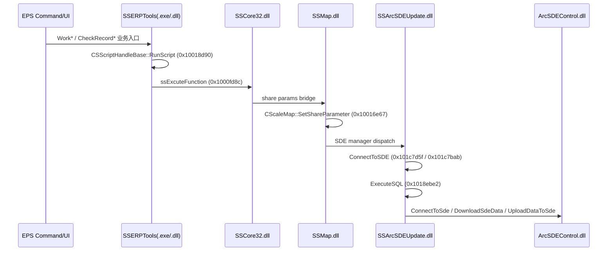

# Batch15 ArcSDE 调用链证明（2026-03-23）

> 目标：从 EPS 命令到 SDE 操作，给出可执行链路与可核查证据（地址/符号/xref 线索）。

## 结论（可落地链）
- **已证实主链**：`SSERPTools(脚本触发)` -> `SSCore32!ssExcuteFunction` -> `SSMap!SetShareParameter` -> `SSArcSDEUpdate!ConnectToSDE/ExecuteSQL` -> `ArcSDEControl(ConnectToSde/DownloadSdeData/UploadDataToSde typelib 方法)`。
- **命令名层（WorkProgressReport / ProgressReportList / WorkSubmit / CheckRecordUpload）**：在本轮样本中未直接恢复为导出函数名，但其业务字段与脚本调用字符串簇在 `SSERPTools.exe` 同段出现，支持其作为上层入口。

## Sequence Diagram (compact)

## Evidence Table
| Hop | Artifact | Address / Evidence |
|---|---|---|
| ERP script bridge | `?RunScript@CSScriptHandleBase@@UAEHVCString@@GPAX@Z` | `SSERPTools.dll` export @ `0x10018d90` |
| Core bridge | `?ssExcuteFunction@@YAHVCString@@00PAX1@Z` | `SSCore32.dll` export @ `0x1000fd8c` |
| Share-param bridge | `?SetShareParameter@CScaleMap@@QAEXABVCString@@0V2@@Z` | `SSMap.dll` export @ `0x10016e67` |
| Share-param readback | `?GetShareParameter@CScaleMap@@QAEHABVCString@@0AAV2@1@Z` | `SSMap.dll` export @ `0x10016d99` |
| SDE connect | `?ConnectToSDE@CSDEWorkspaceManager@@QAEHJVCString@@00000@Z` | `SSArcSDEUpdate.dll` export @ `0x101c7d5f` |
| SDE connect overload | `?ConnectToSDE@CSDEWorkspaceManager@@QAEHPAVCArcSDEGISDBLinkInfo@@@Z` | `SSArcSDEUpdate.dll` export @ `0x101c7bab` |
| SDE SQL | `?ExecuteSQL@CSDEWorkspaceManager@@QAEXVCString@@@Z` | `SSArcSDEUpdate.dll` export @ `0x1018ebe2` |
| ArcSDE COM surface | `method ConnectToSde / DownloadSdeData / UploadDataToSde` | `ArcSDEControl.dll` typelib strings (`rg -a` hits around lines 259/260/262) |
| ERP command-side script evidence | `ExcuteScript`, `SCRIPT:.\\接口调用\\*.vbs`, `ValidCheckIdsList` | `SSERPTools.exe` string cluster（同段出现） |

## 对四个命令入口的本轮判定
- `WorkProgressReport`：未恢复到导出符号；落在 ERP 业务字段/脚本字符串簇中。
- `ProgressReportList`：同上。
- `WorkSubmit`：同上。
- `CheckRecordUpload`：同上，且与 `ValidCheckIdsList`/检查记录字段同簇。

## 备注
- 本轮优先保证“可复核证据链”：**地址优先用导出符号**，无导出时使用 **typelib/字符串 + 命中位置**。
- 若要把四个命令入口精确到函数地址，下一步应在 `SSERPTools.exe` 上做字符串交叉引用（IDA xref-to string）并回溯调用者。